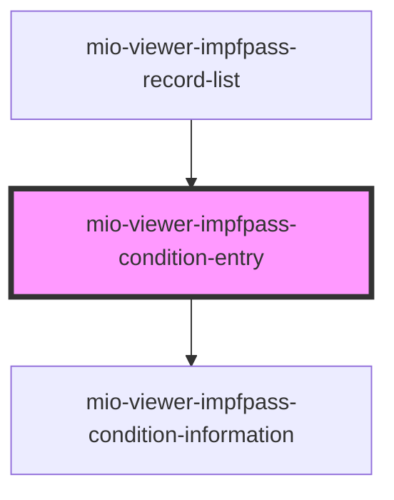

# mio-viewer-impfpass-condition-entry

<!-- Auto Generated Below -->

## Properties

| Property      | Attribute      | Description | Type                  | Default     |
| ------------- | -------------- | ----------- | --------------------- | ----------- |
| `condition`   | --             |             | `ConditionRecordData` | `undefined` |
| `diseaseName` | `disease-name` |             | `string`              | `undefined` |

## Events

| Event              | Description | Type               |
| ------------------ | ----------- | ------------------ |
| `closeInformation` |             | `CustomEvent<any>` |

## Dependencies

### Used by

 - [mio-viewer-impfpass-record-list](../mio-viewer-impfpass-record-list)

### Depends on

- [mio-viewer-impfpass-condition-information](../mio-viewer-impfpass-condition-information)

### Graph

----------------------------------------------

*Built with [StencilJS](https://stenciljs.com/)*
