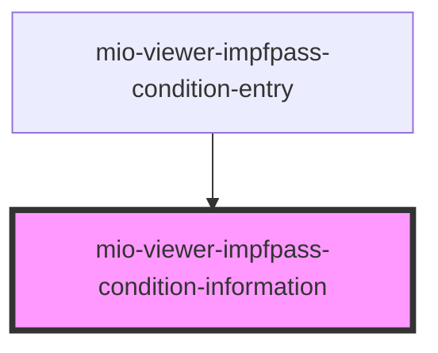

# mio-viewer-impfpass-condition-information

<!-- Auto Generated Below -->

## Properties

| Property   | Attribute   | Description | Type     | Default     |
| ---------- | ----------- | ----------- | -------- | ----------- |
| `infoHead` | `info-head` |             | `string` | `undefined` |
| `infoText` | `info-text` |             | `string` | `undefined` |

## Dependencies

### Used by

 - [mio-viewer-impfpass-condition-entry](../mio-viewer-impfpass-condition-entry)

### Graph

----------------------------------------------

*Built with [StencilJS](https://stenciljs.com/)*
