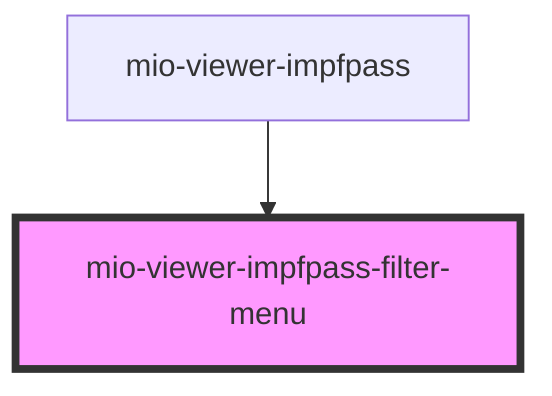

# mio-viewer-impfpass-filter-menu

<!-- Auto Generated Below -->

## Properties

| Property              | Attribute | Description | Type                                                                                                                   | Default     |
| --------------------- | --------- | ----------- | ---------------------------------------------------------------------------------------------------------------------- | ----------- |
| `filterCounts`        | --        |             | `{ typeFilters: { 0: number; 1: number; 2: number; }; lifePhaseFilters: { 0: number; 1: number; 2: number; }; }`       | `undefined` |
| `initialFilterStates` | --        |             | `{ typeFilters: { 0: boolean; 1: boolean; 2: boolean; }; lifePhaseFilters: { 0: boolean; 1: boolean; 2: boolean; }; }` | `undefined` |

## Events

| Event            | Description | Type                                                                                                                                |
| ---------------- | ----------- | ----------------------------------------------------------------------------------------------------------------------------------- |
| `filtersApplied` |             | `CustomEvent<{ typeFilters: { 0: boolean; 1: boolean; 2: boolean; }; lifePhaseFilters: { 0: boolean; 1: boolean; 2: boolean; }; }>` |

## Dependencies

### Used by

 - [mio-viewer-impfpass](../mio-viewer-impfpass)

### Graph

----------------------------------------------

*Built with [StencilJS](https://stenciljs.com/)*
