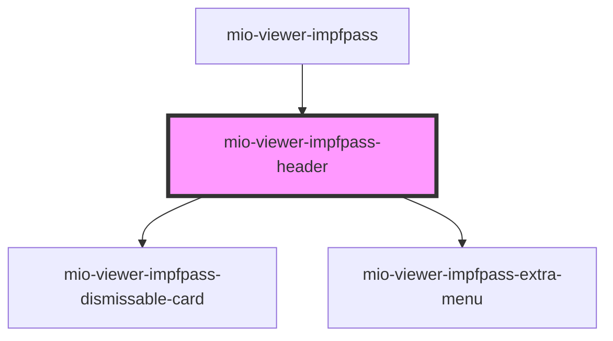

# mio-viewer-impfpass-header

<!-- Auto Generated Below -->

## Properties

| Property  | Attribute | Description | Type             | Default     |
| --------- | --------- | ----------- | ---------------- | ----------- |
| `patient` | --        |             | `PatientDetails` | `undefined` |

## Dependencies

### Used by

 - [mio-viewer-impfpass](../mio-viewer-impfpass)

### Depends on

- [mio-viewer-impfpass-dismissable-card](../mio-viewer-impfpass-dismissable-card)
- [mio-viewer-impfpass-extra-menu](../mio-viewer-impfpass-extra-menu)

### Graph

----------------------------------------------

*Built with [StencilJS](https://stenciljs.com/)*
