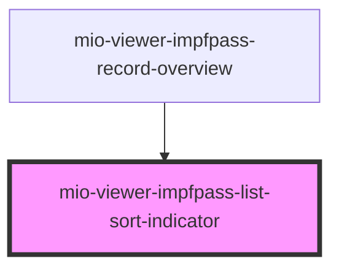

# mio-viewer-impfpass-list-sort-indicator

<!-- Auto Generated Below -->

## Properties

| Property   | Attribute  | Description | Type      | Default     |
| ---------- | ---------- | ----------- | --------- | ----------- |
| `active`   | `active`   |             | `boolean` | `undefined` |
| `reversed` | `reversed` |             | `boolean` | `undefined` |

## Dependencies

### Used by

 - [mio-viewer-impfpass-record-overview](../mio-viewer-impfpass-record-overview)

### Graph

----------------------------------------------

*Built with [StencilJS](https://stenciljs.com/)*
