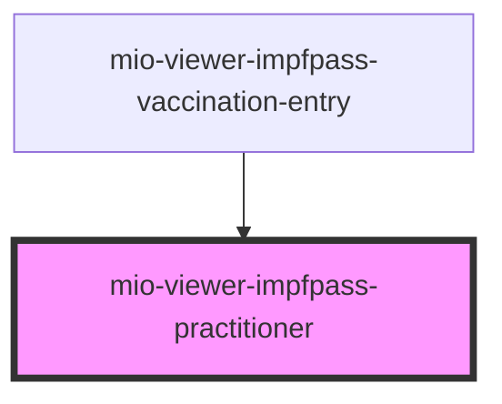

# mio-viewer-impfpass-practitioner

<!-- Auto Generated Below -->

## Properties

| Property           | Attribute           | Description | Type       | Default     |
| ------------------ | ------------------- | ----------- | ---------- | ----------- |
| `adress`           | --                  |             | `string[]` | `undefined` |
| `organisationName` | `organisation-name` |             | `string`   | `undefined` |
| `practitioner`     | `practitioner`      |             | `string`   | `undefined` |
| `qualification`    | `qualification`     |             | `string`   | `undefined` |

## Events

| Event               | Description | Type               |
| ------------------- | ----------- | ------------------ |
| `closePractitioner` |             | `CustomEvent<any>` |

## Dependencies

### Used by

 - [mio-viewer-impfpass-vaccination-entry](../mio-viewer-impfpass-vaccination-entry)

### Graph

----------------------------------------------

*Built with [StencilJS](https://stenciljs.com/)*
