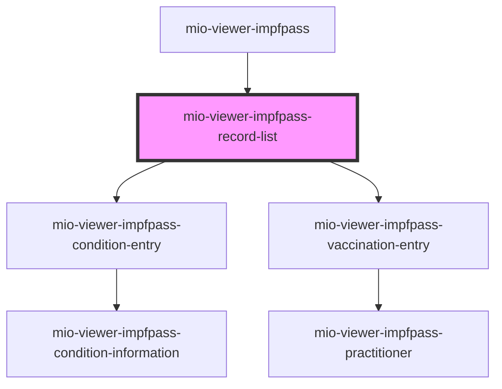

# mio-viewer-impfpass-record-list

<!-- Auto Generated Below -->

## Properties

| Property        | Attribute      | Description | Type           | Default     |
| --------------- | -------------- | ----------- | -------------- | ----------- |
| `diseaseName`   | `disease-name` |             | `string`       | `undefined` |
| `recordDetails` | --             |             | `RecordData[]` | `undefined` |

## Events

| Event           | Description | Type               |
| --------------- | ----------- | ------------------ |
| `detailsHidden` |             | `CustomEvent<any>` |

## Dependencies

### Used by

 - [mio-viewer-impfpass](../mio-viewer-impfpass)

### Depends on

- [mio-viewer-impfpass-condition-entry](../mio-viewer-impfpass-condition-entry)
- [mio-viewer-impfpass-vaccination-entry](../mio-viewer-impfpass-vaccination-entry)

### Graph

----------------------------------------------

*Built with [StencilJS](https://stenciljs.com/)*
