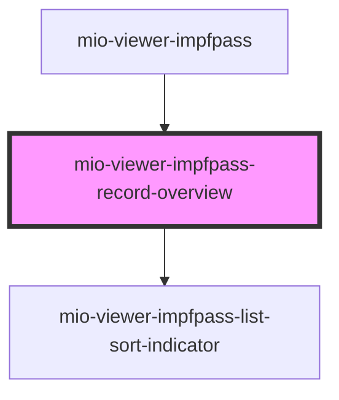

# mio-viewer-impfpass-record-overview

<!-- Auto Generated Below -->

## Properties

| Property              | Attribute          | Description | Type                                                                           | Default     |
| --------------------- | ------------------ | ----------- | ------------------------------------------------------------------------------ | ----------- |
| `recordDataByDisease` | --                 |             | `{ [disease: string]: { records: RecordData[]; latestRecordDate: string; }; }` | `undefined` |
| `selectedDisease`     | `selected-disease` |             | `string`                                                                       | `undefined` |

## Events

| Event             | Description | Type                  |
| ----------------- | ----------- | --------------------- |
| `diseaseSelected` |             | `CustomEvent<string>` |

## Dependencies

### Used by

 - [mio-viewer-impfpass](../mio-viewer-impfpass)

### Depends on

- [mio-viewer-impfpass-list-sort-indicator](../mio-viewer-impfpass-list-sort-indicator)

### Graph

----------------------------------------------

*Built with [StencilJS](https://stenciljs.com/)*
