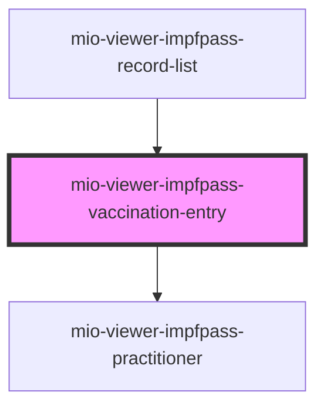

# mio-viewer-impfpass-vaccination-entry

<!-- Auto Generated Below -->

## Properties

| Property      | Attribute      | Description | Type                    | Default     |
| ------------- | -------------- | ----------- | ----------------------- | ----------- |
| `diseaseName` | `disease-name` |             | `string`                | `undefined` |
| `vaccination` | --             |             | `VaccinationRecordData` | `undefined` |

## Dependencies

### Used by

 - [mio-viewer-impfpass-record-list](../mio-viewer-impfpass-record-list)

### Depends on

- [mio-viewer-impfpass-practitioner](../mio-viewer-impfpass-practitioner)

### Graph

----------------------------------------------

*Built with [StencilJS](https://stenciljs.com/)*
