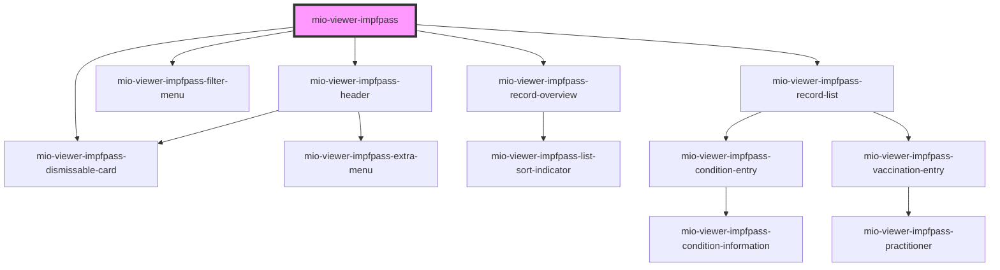

# mio-viewer-impfpass

<!-- Auto Generated Below -->

## Properties

| Property         | Attribute            | Description | Type                 | Default     |
| ---------------- | -------------------- | ----------- | -------------------- | ----------- |
| `base64FhirData` | `base-6-4-fhir-data` |             | `string \| string[]` | `undefined` |

## Dependencies

### Depends on

- [mio-viewer-impfpass-header](../mio-viewer-impfpass-header)
- [mio-viewer-impfpass-dismissable-card](../mio-viewer-impfpass-dismissable-card)
- [mio-viewer-impfpass-filter-menu](../mio-viewer-impfpass-filter-menu)
- [mio-viewer-impfpass-record-overview](../mio-viewer-impfpass-record-overview)
- [mio-viewer-impfpass-record-list](../mio-viewer-impfpass-record-list)

### Graph

----------------------------------------------

*Built with [StencilJS](https://stenciljs.com/)*
